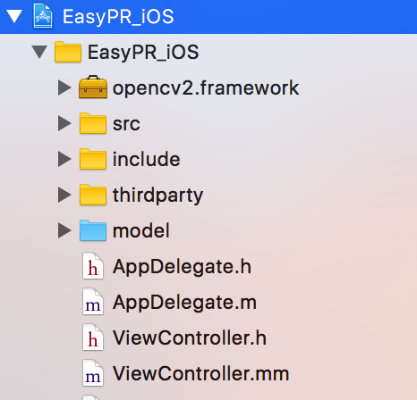

# EasyPR_iOS

介绍如何将EasyPR集成到iOS平台/EasyPR在macOS上调试。

EasyPR github项目地址:[https://github.com/liuruoze/EasyPR](https://github.com/liuruoze/EasyPR)


## 如何在mac上调试

[mac上使用EasyPR进行车牌号识别](https://github.com/tyrad/EasyPR_iOS/blob/master/mac上使用EasyPR进行车牌号识别.md)

## 如何在iOS项目中使用(Xcode9)

1). 集成openCV[具体看这里](http://wiki.tyrad.cc/openCV/macOS上使用openCV.html)

2). 添加`src`、`thirdparty`、`include`、`model`  (model为蓝色)

<!--

-->


并保证

`copy bundle resource`里引入了蓝色文件夹`model`
`Complie Sources`添加了src和util的文件夹内cpp文件


3). `Header Search Path`添加`$(SRCROOT)/EasyPR_iOS/include`

4). 尝试`#include "easypr.h"`发现报错


<!---->

原因应该是名字和iOS`MacTypes.h`的冲突了
处理方法:报错的全部加`cv::`前缀。

5). 尝试运行,发现报错,原因是路径的问题


解决方法参考了[https://github.com/zhoushiwei/EasyPR-iOS](https://github.com/zhoushiwei/EasyPR-iOS):


根据`include/esaypr/config.h`里的变量名,创建全局变量,并修改源码。

新建cpp文件:

`SGGlobalEasyPRPath.hpp:`

``` c++
#ifndef SGGlobalEasyPRPath_hpp
#define SGGlobalEasyPRPath_hpp

#include <stdio.h>
#include <string>

class SGGlobalEasyPRPath {
public:
    static std::string kDefaultSvmPath;
    static std::string kLBPSvmPath;
    static std::string kHistSvmPath;    
    static std::string kDefaultAnnPath;
    static std::string kChineseAnnPath;
    static std::string kGrayAnnPath;
    static std::string kChineseMappingPath;
    SGGlobalEasyPRPath()=default;    
private:
};
#endif /* SGGlobalEasyPRPath_hpp */
```

`SGGlobalEasyPRPath.hpp`:

``` cpp
#include "SGGlobalEasyPRPath.hpp"

std::string SGGlobalEasyPRPath::kDefaultSvmPath;
std::string SGGlobalEasyPRPath::kLBPSvmPath;
std::string SGGlobalEasyPRPath::kHistSvmPath;

std::string SGGlobalEasyPRPath::kDefaultAnnPath;
std::string SGGlobalEasyPRPath::kChineseAnnPath;
std::string SGGlobalEasyPRPath::kGrayAnnPath;
std::string SGGlobalEasyPRPath::kChineseMappingPath;
```

使用之前赋给变量值,比如写到`AppDelegate.mm`里面:

``` objc
#import "AppDelegate.h"
#include "SGGlobalEasyPRPath.hpp"
@implementation AppDelegate

- (BOOL)application:(UIApplication *)application didFinishLaunchingWithOptions:(NSDictionary *)launchOptions {    
    NSString* bundlePath=[[NSBundle mainBundle] bundlePath];
    SGGlobalEasyPRPath::kDefaultSvmPath = [[NSString stringWithFormat:@"%@/model/svm_hist.xml",bundlePath] UTF8String];;
    SGGlobalEasyPRPath::kLBPSvmPath = [[NSString stringWithFormat:@"%@/model/svm_lbp.xml",bundlePath] UTF8String];;
    SGGlobalEasyPRPath::kHistSvmPath = [[NSString stringWithFormat:@"%@/model/svm_hist.xml",bundlePath] UTF8String];;
    SGGlobalEasyPRPath::kDefaultAnnPath = [[NSString stringWithFormat:@"%@/model/ann.xml",bundlePath] UTF8String];;
    SGGlobalEasyPRPath::kChineseAnnPath = [[NSString stringWithFormat:@"%@/model/ann_chinese.xml",bundlePath] UTF8String];;
    SGGlobalEasyPRPath::kGrayAnnPath = [[NSString stringWithFormat:@"%@/model/annCh.xml",bundlePath] UTF8String];;
    SGGlobalEasyPRPath::kChineseMappingPath = [[NSString stringWithFormat:@"%@/model/province_mapping",bundlePath] UTF8String];;
    std::cout<<"SGGlobalEasyPRPath::mainBundle():"<< SGGlobalEasyPRPath::kChineseAnnPath  <<std::endl;
    return YES;
}
@end
```


然后修改源代码,将用到路径的地方 `#include "SGGlobalEasyPRPath.hpp"`并添加前缀`SGGlobalEasyPRPath::`

如:`kChineseMappingPath`改为`SGGlobalEasyPRPath::kChineseMappingPath`。


> 注意:引用`SGGlobalEasyPRPath.hpp`的.m文件,后缀改为.mm  

5). 跑下测试效果


``` objc
#import "ViewController.h"

#import <opencv2/opencv.hpp>

#include "easypr.h"
using namespace cv;
using namespace easypr;

@interface ViewController ()

@end

@implementation ViewController

- (void)viewDidLoad {
    [super viewDidLoad];
    [self myFunction];
}

- (void)myFunction{
    
    cv::Mat cvImage;
    cv::Mat RGB;
    CPlateRecognize pr;
    
    NSString *path = [[NSBundle mainBundle] pathForResource:@"test" ofType:@"jpg"];
    Mat img = imread([path UTF8String]);
 
    if (img.empty()) {
        return;
    }
    cvtColor(img, RGB, COLOR_BGRA2RGB);
    vector<CPlate> plateVec;
    int result = pr.plateRecognize(RGB, plateVec);
    NSLog(@"result %@",@(result));
    if (result != 0) cout << "result:" << result << endl;
    if(plateVec.size()==0){
        
    }else {
        string name=plateVec[0].getPlateStr();
        NSString *resultMessage = [NSString stringWithCString:plateVec[0].getPlateStr().c_str()
                                                     encoding:NSUTF8StringEncoding];
        NSLog(@"%@",resultMessage);
    }
}
@end
```

<!---->


